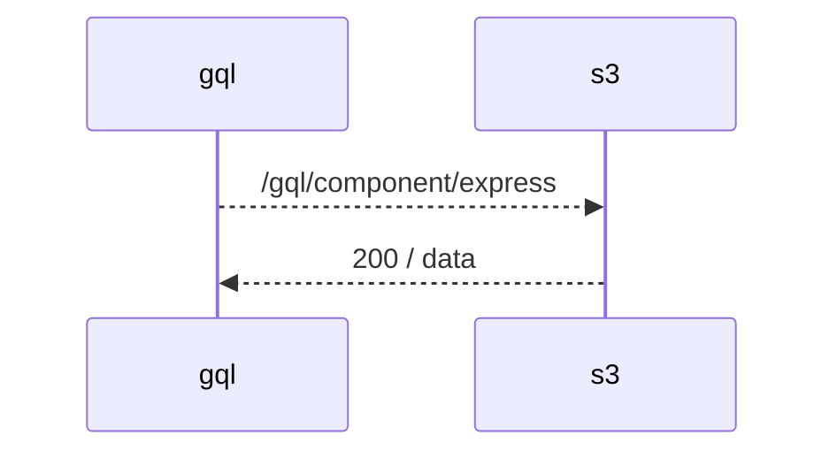
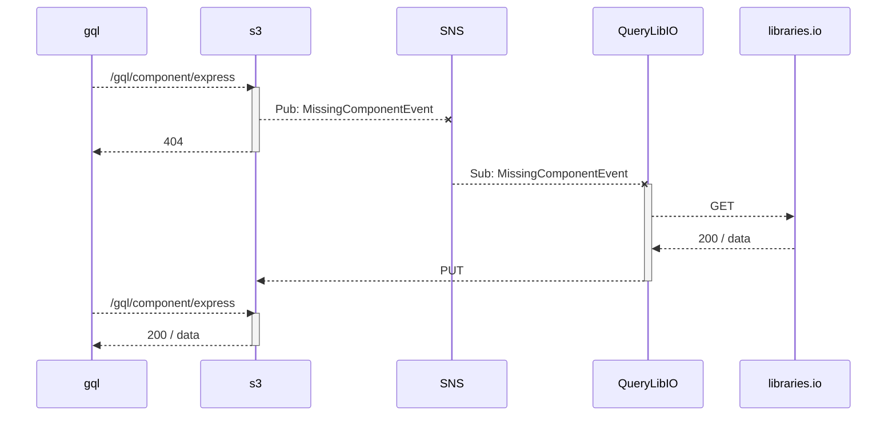
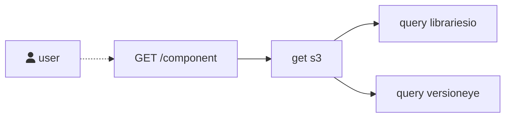

# Stpl - Your Apps. Your Stacks.

 * http://i.stpl.io
 * https://0m4mv2f1y8.execute-api.us-east-1.amazonaws.com/dev/component/npm/express

## Develop

### Prerequisites

Get an API Key at: https://libraries.io/account and https://www.versioneye.com/settings/api

create an env.json:

    {
        "LIBRARIES_IO_API_KEY": "TODO",
        "VERSIONEYE_API_KEY": "TODO"
    }

Install aws tools, apex.

    $ make deploy

## TODOs

[] each component anaylsis kicksoff analysis for dependencies. display tree of dependencies.
  
Ï
## Ideas
https://knsv.github.io/mermaid/#links-between-nodes

[] client notification:
  * https://serverless.com/blog/serverless-notifications-on-aws/

## Component data cached

## Component data missubg

### Functional:

Datasources: snyk, blackduck, npmjs dependencies, https://api.npms.io/v2/package/express https://npms.io/about https://api-docs.npms.io/ nodesecurity.io https://codeclimate.com/
https://api.nodesecurity.io/check/express/4.9.8
### Non-Functional:
usejsdoc.org
use graphql
 - have stable subtree
 - have an unstable subtree (alpha) e.g. librariesio, versionexe

## Architectural lessons learned

* Send events not messages (See talk from Paul Johnston)
* Error handling !!!
* Throttle requests ? 

## Snyk

* cd snyk
* clone repo https://github.com/snyk/vulnerabilitydb
* delete all but data and license
* aws s3 sync data/ s3://vulnerabilitydb

https://runkit.com/home

