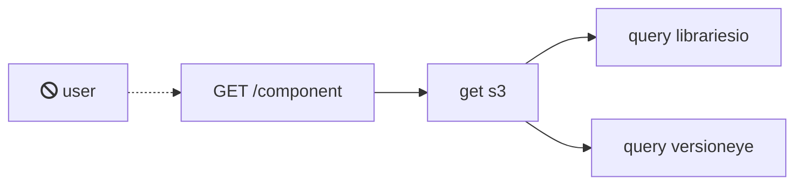

# Stpl

 * http://i.stpl.io
 * https://0m4mv2f1y8.execute-api.us-east-1.amazonaws.com/dev/component/npm/express

## Deploy
supply an env.json:
    {
        "LIBRARIES_IO_API_KEY": "TODO",
        "VERSIONEYE_API_KEY": "TODO"
    }

    $ apex deploy --env-file env.json

    $ aws s3 cp frontend/index.html s3://i.stpl.io --grants read=uri=http://acs.amazonaws.com/groups/global/AllUsers

## TODOs

[] each component anaylsis kicksoff analysis for dependencies. display tree of dependencies.
[] client notification:
  * https://serverless.com/blog/serverless-notifications-on-aws/
  

## Ideas

https://knsv.github.io/mermaid/#links-between-nodes

### Functional:

Datasources: snyk, blackduck, npmjs dependencies

### Non-Functional:
usejsdoc.org
use graphql
 - have stable subtree
 - have an unstable subtree (alpha) e.g. librariesio, versionexe

## Architectural lessons learned

* Send events not messages (See talk from Paul Johnston)
* Error handling !!!
* Throttle requests ? 
